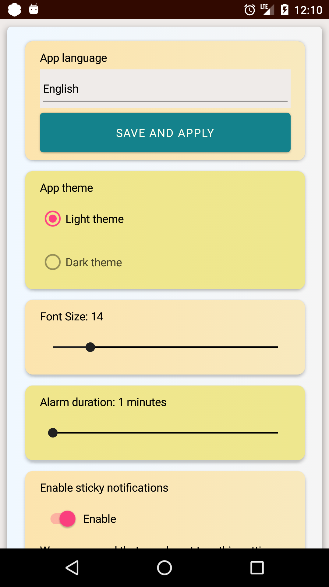

# Suleymaniye Takvimi 
Suleymaniyetakvimi.com Xamarin mobil uygulaması

## Özellikler:

* Günlük namaz vakitleri
* Aylık namaz vakitleri
* Alarm
* Bildirim
* Titreşim
* Kıble göstergesi
* Online Radyo [Radyo Fıtrat](https://www.radyofitrat.com)
* Almanca, Arapça, Azerice, Çince, Farsça, Fransızca, İnglizce, Rusça, Türkçe ve Uygurca dil desteği
* Koyu va Açık temalar
* Uygulama widget'ı
<!--
**Mevcut Özellikler:**

* Cihazın konumunu alabilir ve ona göre günlük veya aylık namaz vakitlerini görüntüleyebilir.
* Kullanıcı seçtiği ayarlara göre bildirim, titreşim ve sesli hatırlatma yapabilir.
* Arayüzdeki şehir adına tıklayarak haritadaki konumu, aylık takvime tıklayarak aylık namaz vakitlerini gösteriyor, aylık takvim yerel dosyaya kaydediliyor.
* Kıble yönünü belirtmek için bir pusula eklendi (pusula özelliğini desteklemeyen cihazlarda çalışmıyor).
* [Radyo Fıtrat](https://www.radyofitrat.com)'tan çevrimiçi radyo çalabiliyor, radyo web sayfsı ve radyo akışının linklerini gösteriyor.
* Sitelerimiz ve sosyal medya bağlantıları, Namaz vakitleri hakkındakı yazıyı gösteriyor.
* Kullanıcı seçimine göre Türkçe, İnglizce, Almanca, Arapça, Azerice, Farsça, Fransızca, Rusça, Çince ve Uygurca ara yüzü destekler.
* Koyu tema ve açık tema modları var.
* Android için widget özelliği eklendi.

**Yayın notları:**
-->

## Yayın notları:

*2.1.7 sürümündeki yenilikler (2024-08-20):*
* Bazı hatalar düzeltildi.
* Namaz vakitlerini alma işlemi iyileştirildi, Artık eski ve yeni bağlantıların hangisinden hızlı veri alabilirse onu kullanacak.
* Namaz vakitlerini alamadığında durmadan tekrar denemesi düzeltildi.

*2.1.6 sürümündeki yenilikler (2024-06-07):*
* Bazı hatalar düzeltildi.

*2.1.5 sürümündeki yenilikler (2024-04-25):*
* Bazı ülkelerde şehir adını gösterememesi düzeltildi.
* Aylık takvim ve hakkında sayfasına paylaşma seçenekleri eklendi.
* Dil seçenekleri listesi değiştirildi.
* Takvim verilerini alma bağlantıları güncellendi ve artık aylık takvim iki aylık namaz vakitlerini gösteriyor.
* Widget'te artık şehir adını da gösteriyor.
* Başka ufak düzeltmeler yapıldı

*2.1.4 sürümündeki yenilikler (2023-10-13):*
* Radyo bağlantısı düzeltildi.

*2.1.3 sürümündeki yenilikler (2023-8-22):*
* Bazı cihazlarda alarmı kapatınca zamanı geldiğinde yine çalması düzeltildi.
* Android 13 ve sonraki Android sürümlerinde bildiri izni sormak zorunlu olduğu için bildirim izni sorma eklendi.

*2.1.2 sürümündeki yenilikler (2023-03-24):*
* Bazı cihazlarda radyo çalmama problemi düzeltildi.
* Alarm planlama bir haftadan iki haftalık planlamaya değiştirildi.

*2.1.1 sürümündeki yenilikler (2023-01-14):*
* Ayarlara "Uygulama her açıldığında konum ve namaz vakitlerini yenile" seçeneği eklendi.
* Bazı küçük sorunlar düzeltildi.

*2.1.0 sürümündeki yenilikler (2022-08-17):*
* Bildirim gösterirken fazladan "Test Alarmı" gösterip ezan çalası düzeltildi.

*2.0.9 sürümündeki yenilikler (2022--07-29):*
* Bildirim sesi artık seçilen sesleri çalıyor, alarm çalma penceresi kullanmadan bildirim ile alarm kullanabilirsiniz.
* Yapışkan bildirimde tüm namaz vakitleri göstermeme seçeneği eklendi.
* Widget yazı boyutları küçük ekranları baz alarak biraz küçültüldü, belli aralıkla "Namaz vakitleri güncellendi" mesajı göstermesi düzeltildi, Android 5 ve 6 sürümlerindeki widget hatası düzeltildi.
* Özbekçe dil desteği eklendi.
* Önceki uygulamadaki bazı ses dosyaları eklendi.

*2.0.8 sürümündeki yenilikler (2022-05-18):*
* Arapça, Azerice, Almanca, Farsça, Fransızca ve Rusça dil destekleri eklendi.
* Android 10 ve sonraki sürümlerde sistem kısıtlamalarından dolayı alarm çalma penceresi bildirim gösterme ve bildirim sesiyle değiştirildi.
* Artık yapışkan bildirimde tüm namaz vakitleri gösteriliyor.
* Widget özelliği eklendi.

*2.0.7 sürümündeki yenilikler (2022-04-25):*
* Kullanıcılar arayüz yazı büyüklüğünü ayarlardan değiştirebilirler.
* Alarm başladıktan sonra keniliğinden kapanma süresini ayarlardan değiştirebilir.
* Ayarlara sürekli kalan yapışkan bildirimi kapatma seçeneği eklendi.
* Ana ekrana kalan süreyi gösteren bir özellik eklendi.

*2.0.6 sürümündeki yenilikler (2022-04-23):*
* Cihaz pusulayı desteklemediğinde oluşan kilitlenme düzeltildi.
* Tekrar tekrar alarm sesi seçildiğinde oluşan donma sorunu düzeltildi.
* Konum davranışı iyileştirildi: Yenile düğmesiyle yenilenmedikçe, artık ilk kez alındıktan sonra konum sormuyor.
* Ayarlar sayfasında uygulama dilini seç seçeneği eklendi.
* Tema değişikliği ayarlar sayfasına taşındı.
* Yazı boyutları küçültüldü.

*2.0.5 sürümündeki yenilikler (2022-04-18):*
* geçersiz konumdan dolayı kapanış düzeltildi.

*2.0.4 sürümündeki yenilikler (2022-04-18):*
* Bazı nadir hatalar düzeltildi, konum ve namaz vakitlerini gösterme iyileştirildi.

*2.0.3 sürümündeki yenilikler (2022-04-13):*
* Hakkında sayfası yeniden tasarlandı, renkler daha iyileştirildi, konum izni alma özelliği iyileştiridi.

*2.0.2 sürümündeki yenilikler (2022-04-07):*
* Şimdilik Türkçe, İngilizce ve Çince dil tercümeleri mevcuttur, yakında başka dillerde eklenecek.

*2.0.1 sürümündeki yenilikler (2022-04-04):*
* Alarm kurarken bazen oluşan ani kapanma olayı düzeltildi.

*2.0 sürümündeki yenilikler (2022-03-31):*
* Uygulama yeniden tasarlandı ve yeni Özellikler eklendi.

**Ekran Görüntüleri:**
<!--
|   Namaz  Vakitleri   |   Alarm   Ayarları   |   Kıble  Gösterici   |    Radyo  Sayfası    |   Hakkında sayfası   |    Alarm  sayfası    |     App   Widget     |
| :------------------: | :------------------: | :------------------: | :------------------: | :------------------: | :------------------: | :------------------: |
|  |  |  |  |  |  |  |

Namaz Vakitleri:    
Alarm Ayarları:     
Kıble Gösterici:    
Radyo Sayfası:      
Hakkında sayfası:   
Alarm sayfası:      
-->
|   Uygulama  Sayfası   |     Kısa Açıklama     |   Ekran Görüntüleri   |
| :-------------------: | :-------------------: | :-------------------: |
|    **Namaz Vakitleri**    |    Günlük namaz vakitleri    |  |
|    **Alarm  Ayarları**    |    Her namaz vaktının alarm ayarları    |  |
|    **Kıble Gösterici**    |    Kıble gösterici (cihaz pusula desteklemiyorsa çalışmıyor)    |  |
|     **Radyo Sayfası**     |     Radyo Fıtrat online radyo     |  |
|   **Hakkında  sayfası**   |   Uygulama ve namaz vakitleri hakkında   |  |
|     **Alarm sayfası**     |     Alarm çaldığında gözüken pencere (Android 10 ve sonraki sürümlerde sadece bildiri gösteriliyor)     |  |
|   **Ayarlar   sayfası**   |      Uygulama dili, alarm süresi, yazı boyutu, ... ayarları     |  |
|   **Uygulama Widget'ı**   |      Uygulama widget'ı ön izlemesi     |  |

**Uygulama geliştirme notları:**
* Android'te Özel bir 'Activity'i en öne getirp integre alarm uygulaması gibi gösterilebidiği için, İOS teki gibi sadece bildirim göstermek yerine özel 'Activity' ile ses çalma, bidirim ve titremeler çalıştırıldı. Android 10 ve sonraki sürümlerde uygulama ön planda değilken böyle bir activity göstermeyi yasakladığı için, bu sistemlerde sadece bildirim gösterildi.
* Android'te [arka planda çalışma kısıtlandığı](https://docs.microsoft.com/en-us/xamarin/android/app-fundamentals/services/#background-execution-limits-in-android-80) ve [Doze mode](https://devblogs.microsoft.com/xamarin/understanding-androids-doze-functionality/) uygulandığı için ['Foreground Service'](https://docs.microsoft.com/en-us/xamarin/android/app-fundamentals/services/foreground-services) kullanarak uygulamanın sürekli çalışması sağlandı. Ama 'Foreground Service'in sürekli kalan bildirimi bazı telefonlarda (özellikle çoğu çinli şirketlerin telefonlarında) RAM temizleyince kapanıyor aynı zamanda kullanıcının uygulama için pil kıstlamaması ve arka planda çalışmasına izin vermesi gerekiyor.
* Aylık takvimi cihazın konumu ve zamanına(Tarih ve zaman dilimine) göre [suleymaniyetakvimi.com](https://www.suleymaniyetakvimi.com) sitesinden o günden başlayarak bir aylık gelecek namaz vakitlerini alarak kaydediyor. İndirdiği namaz vakitlerine göre o günlük namaz vakitlerini uygulamada gösteriyor ve kullanıcının seçimlerine uygun şekilde, seçilen namaz vakitleri için zamanlama yapıyor.
* Alarm (ses çalma, titreme, bildirim) zamanlaması haftalık olarak (aylık olunca cihazı zorlıyor) ayarlandı ve bu bir haftalık zamanlamanın son 2 günü kala, yine bir haftalık zamanlanacak şekilde ayarlandı. Daha hızlı olması için vakitleri aylık takvim dosyasından okuyarak zamanlıyor.
* Bazı cihazlarda (Xiaomi gibi) 'Foreground Service' kapanıp açılıyor ve zamanlamalar kaybolıyor (uygulama kapnıp açılıyor gibi), o yüzden servis başlarken ve uygulama ana sayfası açılırken her ikisinde zamanlama çalıştırıldı ve uygulamayı yavaşlatmaması için zamanlama geciktirelrek çalıştırıldı.
* İOS için sadece bildiri göstererek kullanıcının seçtiği sesle hatırlatma yapar.
* Konumu bir kere aldıktan sonra kaydederek, sonrasında konum kapalı olsa bile yine de namaz vakitlerini indirip göstermeye devam edebiliyor. Ana sayfadaki yenile tuşuna tıklayarak konumu ve namaz vakitlerini yenileyebiliyor, böyle yenilerken konum yenilendiği için aylık namaz vakilerini de yeniliyor ve yeniden zamanlama yapıyor.
* Kıble göstergesi sayfasında kaydedilen konumun koordinatları gösteriyor ve üstteki yenile tuşuna tıklayınca konumu yeniliyor.
* Şehir adına tıklayınca kaydedilen konumu haritadan gösteriyor, aylık takvime tıklayınca bir aylık namaz vaiktleri takvimini gösteriyor.
---
 

# Suleymaniye Calendar
Suleymaniyetakvimi.com Xamarin mobile application

## Features:

* Daily prayer times
* Monthly prayer times
* Alarm
* Notification
* Vibration
* Qibla indicator
* Online radio [Radyo Fıtrat](https://www.radyofitrat.com)
* Arabic, Azerbaijani, Chinese, English, French, German, Persian, Russian, Turkish and Uyghur language support
* Dark and Light theme
* App widget
<!--
**Current Features:**
* Get device current location and display corresponding daily or monthly prayer times.
* Reminding with notification, vibration and sound based on user preferences.
* When touch the Monthly time button show up monthly prayer times, monthly prayer times were saved in local file.
* Implementd a compass for indicate qibla direction.
* Online radio from [Radyo Fitrat](https://www.radyofitrat.com) and links for the site and radio schedules.
* Links for our sites and social media, An article about prayer times.
* Support Turkish, English, Arabic, Azerbaijani, Chinese, French, German, Persian, Russian and Uyghur language UI based on the user choice.
* Support dark and light UI mode.
* Android widget support for daily prayer times.

**Release notes:**
-->

## Release notes:

*What's new in version 2.1.5 (2024-04-25):*
* Fixed the city name not being displayed in some countries.
* Added sharing options to the monthly calendar and about page.
* Language options list has been changed.
* Links to retrieve calendar data have been updated and the monthly calendar now shows prayer times for two months.
* Widget now display city too.
* Other minor fixes were made.

*What's new in version 2.1.4 (2023-10-13):*
* Radio link has updated.

*What's new in version 2.1.3 (2023-08-22):*
* Fixed the problem of keep alarming even turn off the alarm on some devices.
* Since it is mandatory added ask notification permission feature for Android 13 and later.

*What's new in version 2.1.2 (2023-03-24):*
* Fixed the problem of not playing the radio on some devices.
* Alarm scheduling changed from one week to two week scheduling.
* The vibration option has been removed as it can only show notifications on Android 10 and later.

*What's new in version 2.1.1 (2023-01-14):
* Add an option for "renew location and prayer times when open application every time" in settings.
* Fixed some minor issues.

*What's new in version 2.1.0 (2022-08-17):*
* Fixed the extra notification with the name "Test Alarm" that playing Adhan.

*What's new in version 2.0.9 (2022-07-29):*
* Notification sound now plays selected sounds, if you don't want to use alarm window, you can use notification option.
* Added option to not show all prayer times in sticky notification.
* Widget font sizes have been slightly reduced based on small screens, the repeated message "Prayer times have been updated" has been fixed, the widget error in Android 5 and 6 versions has been fixed.
* Added Uzbek language support.
* Added some audio files from the previous app.

*What's new in version 2.0.8 (2022-05-18):*
* Added Arabic, Azerbaijani, German, Persian, French, Russian language support.
* Alarm window replaced with notification and notification ringtone in Android 10 and later version, because the system restriction.
* Steaky notification now include all prayer times.
* Added Widget support.

*What's new in version 2.0.7 (2022-04-25):*
* Users can change the interface font size from the settings.
* After the alarm starts, you can change the automatic shutdown time from the settings.
* Added option to turn off sticky notification in settings.
* Added a feature that displays the remaining time to the main screen.

*What's new in version 2.0.6 (2022-04-23):*
* Fixed crashing when device not support compass.
* Fixed freezing when repeatedly choose alarm sound.
* Location behavior improved: now never asking location after get it first time, unless refresh it with refresh button.
* Added choose app language option in settings page.
* Theme changing moved to settings page.
* Font sizes decreased.

*What's new in version 2.0.5 (2022-04-18):*
* Fixed crashing over invalid location.

*What's new in version 2.0.4 (2022-04-18):*
* Fixed some rare errors, improved location and display prayer times related features.

*What's new in version 2.0.3 (2022-04-13):*
* Redesigned About page, improved colors and location permission request process.

*What's new in version 2.0.2 (2022-04-07):*
* Changed Default language for non translated languages to English.
* Currently support English, Turkish, Chinese and more will come.

*What's new in version 2.0.1 (2022-04-04):*
* Fixed an issue that crashing when setup alarms sometimes.

*What's new in version 2.0 (2022-03-31):*
* Completely redesigned the application and add new features.
